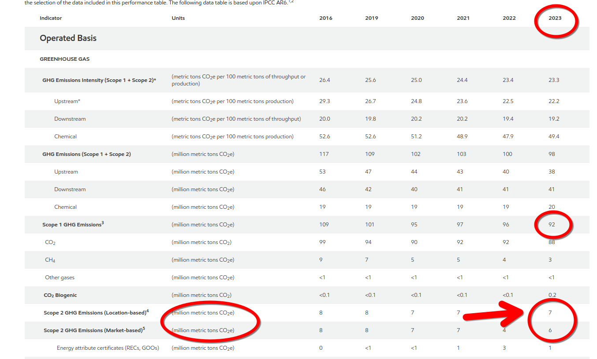
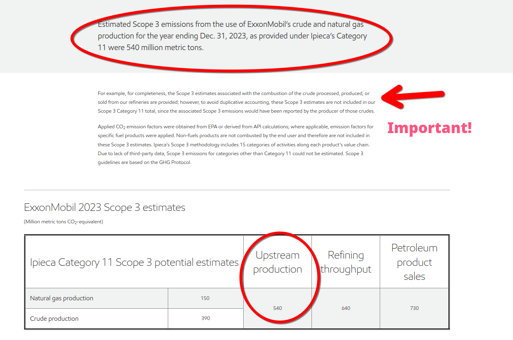

# Benchmarks for validation

## Exxon (XOM), 2023 GHG Emissions Data

 

 
 
### Scope 1 Emissions, Operated Basis

92 million metric tons of CO2e

### Scope 2 Emissions, Operated Basis (Location Based)

7 million metric tons of CO2e

### Scope 2 Emissions, Operated Basis (Market Based)

6 million metric tons of CO2e

Source: https://corporate.exxonmobil.com/sustainability-and-reports/metrics-and-data#Scope3emissions

### Scope 3 Emissions

540 million metric tons of CO2e

---

# Calculated Values

Here is the data converted into a table format, including the calculations for emissions and their monetized values:

## Exxon (XOM), 2023 GHG Emissions Data

| **Scope**                            | **Emissions (million metric tons of CO2e)** | **Monetized Emissions (in million USD)** |
|--------------------------------------|--------------------------------------------|------------------------------------------|
| Scope 1 Emissions, Operated Basis    | 92                                         | 21,712                                   |
| Scope 2 Emissions, Operated Basis (Location Based) | 7                                          | 1,652                                    |
| Scope 2 Emissions, Operated Basis (Market Based)   | 6                                          | 1,416                                    |
| Scope 3 Emissions                    | 540                                        | 127,440                                  |
| **All Scope Emissions**              | **639**                                    | **152,220**                              |

## Monetised Emissions All Scopes

$150.80 BN 

## Financial Performance Values

### Finanical Data (Year End 2022)

EBITDA estimate: $102.59 BN (Macrotrends), round to $102.59BN

I'll help you calculate these figures and present them in a markdown table.

Calculations:
1. EBITDA - Monetized Emissions = 102.59B - 150.80B = -48.21B
2. Monetized Emissions Intensity = Monetized Emissions / EBITDA = 150.80B / 102.59B = 1.47

| Metric | Value |
|--------|--------|
| EBITDA | $102.59B |
| Monetized All Scopes Emissions | $150.80B |
| EBITDA - Monetized Emissions | -$48.21B |
| Monetized Emissions Intensity | 1.47x |

The negative value in EBITDA - Monetized Emissions indicates that the monetized emissions exceed EBITDA by $48.21B. 

The Monetized Emissions Intensity of 1.47x shows that the monetized emissions are 147% of EBITDA.

### Full Year Earnings

$55.7BN

### Revenue

$413.68 BN

### Gross Profit

$114.193BN